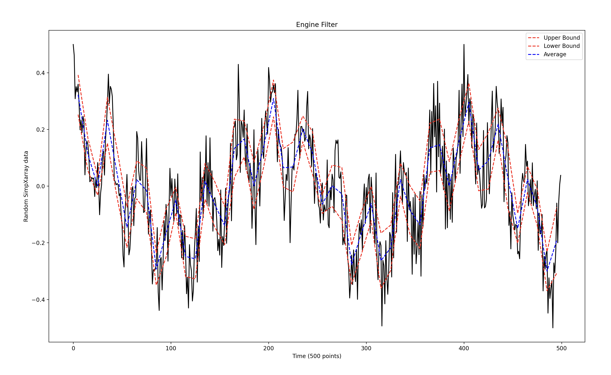

The purpose of this repo is to filter out noisy data from a test bed rocket engine. 
the filter will find a statistical upper and lower bound givin a sample size and confidence, then proceed to plot a graph of the data, the bounds, and the average using matplot lib. 

example: 

